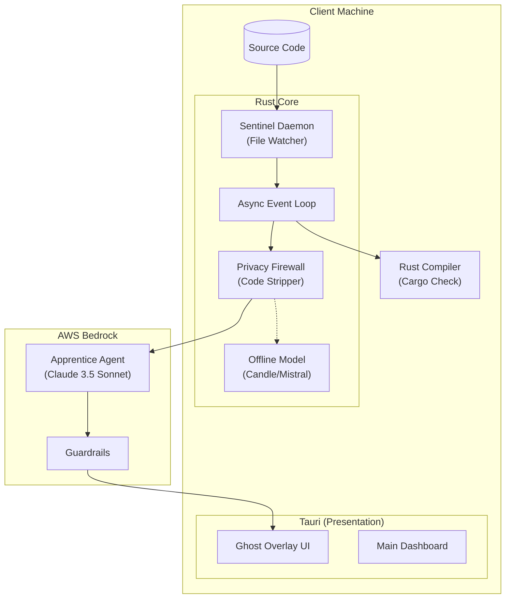

# Protégé 🧠

> **The AI that makes you think.**
> *A Socratic Coding Companion designed to defeat "AI Skill Atrophy."*

***

## 🚨 The Problem: "The Copilot Trap"

In the era of Generative AI, students and junior developers fall into **"Zombie Mode."** They hit `Tab` to accept AI-generated code without processing the logic.

This creates **Skill Atrophy**: GitHub portfolios they can't defend in whiteboard interviews.

## 🛡️ The Solution: Pedagogical Inversion

**Protégé** flips the AI model—**AI asks, Human answers** using a **"Wannabe Idiot" Apprentice** persona.

Users master the **Feynman Technique** (learn by teaching) through **Active Recall**.

***

## 🎥 Demo

*Will Upload later*

***

## ⚙️ How It Works

### Phase 1: The Architect (Decision Mode)

Acts as a strict Senior Architect before any code:

- **Interrogation:** "SQL or NoSQL? Why?"
- **Scaffolding:** Generates `roadmap.json` + project init **after** justification


### Phase 2: The Apprentice (The "Struggle")

**"Wannabe Idiot" forces deep understanding:**

1. **Sentinel:** Rust daemon watches files in real-time
2. **Intervention:** Hides error logs on mistakes (Borrow Checker, etc.)
3. **Ghost Overlay:** "Boss, you moved `data` into thread line 40. How do we use it here?"
4. **Fix:** Type explanation to clear overlay

***

## 🏗️ System Architecture

**Local-First, Hybrid-Cloud** for privacy + performance.



For deeper dive: [DESIGN.md](DESIGN.md) | [REQUIREMENTS.md](REQUIREMENTS.md)

## ⚡ Technical Stack

| Component | Tech Choice | Justification |
| :-- | :-- | :-- |
| **Core** | Rust + Tauri v2 | <15MB native binaries |
| **Frontend** | Svelte 5 (Runes) | Zero virtual DOM overhead |
| **Intelligence** | AWS Bedrock | Claude 3.5 Sonnet reasoning |
| **Privacy** | Rust Candle | Offline Phi-2/Mistral |
| **Styling** | Tailwind + Bits UI | Headless accessible components |

## 🟥 AMD Hardware Integration

**Cloud:** AWS EC2 m7a (AMD EPYC™) → 20% cost reduction
**Local:** Ryzen AI NPU → Zero battery impact
**Privacy:** ROCm™ → High-speed offline inference

## 🧪 Scientific Basis

- **Desirable Difficulties** (Bjork \& Bjork, 2011)
- **Generation Effect** (Slamecka \& Graf, 1978)

***

## 🚀 Getting Started

### Prerequisites

- Rust: v1.75+
- Node.js: v18+
- npm
- Windows 10/11 (for window-vibrancy)


### Installation

```bash
git clone https://github.com/yourusername/protege.git
cd protege
npm install
cargo tauri dev
```

**Note:** First run downloads Mistral 7B (~4GB) for offline mode.

***

## 🔮 Roadmap

- ✅ Phase 1: File Watching \& Error Trapping
- ✅ Phase 2: Socratic Agent (Bedrock)
- ✅ Phase 3: Ghost Overlay (Tauri/Svelte)
- ⏳ Phase 4: VS Code Extension
- ⏳ Phase 5: Team Mode


## 📄 License

[MIT License](LICENSE) © 2025 Devanshu Sharma

***