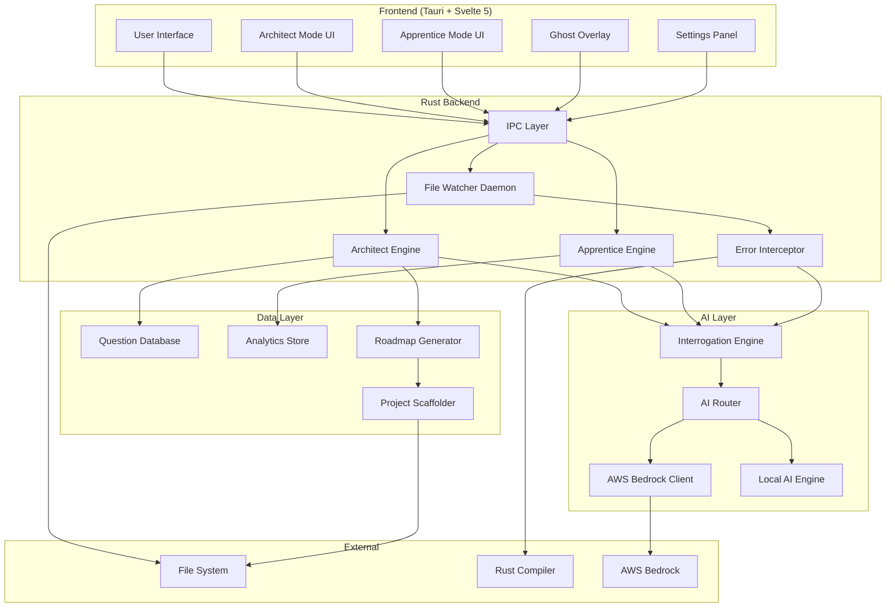
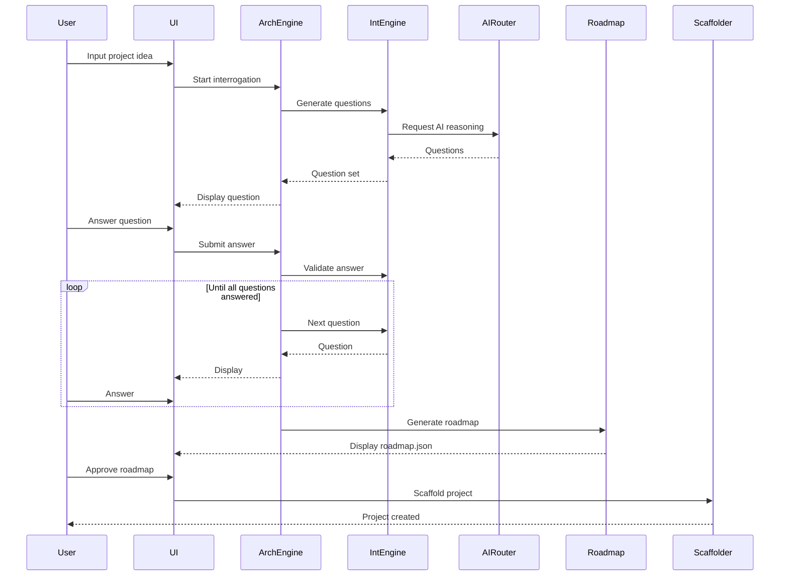
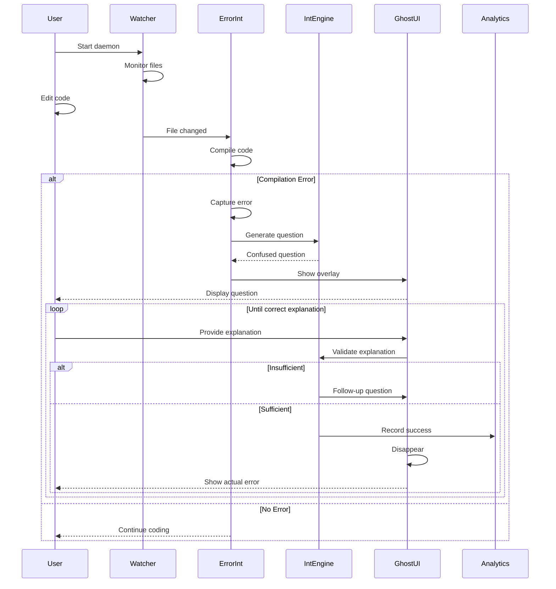

# Design Document: Protégé

## Overview

Protégé is an educational AI coding assistant that implements "Pedagogical Inversion" - instead of automating code generation, it automates the Socratic Method to force developers to think deeply about architecture, syntax, and logic. The system operates in two distinct phases:

1. **Architect Mode**: Interrogates users about architectural decisions before any code is written
2. **Apprentice Mode**: Acts as a confused junior developer when errors occur, forcing users to explain solutions

The application is built as a native desktop application using Tauri v2 with a Svelte 5 frontend and Rust backend. It leverages both cloud AI (AWS Bedrock with Claude 3.5) for complex reasoning and local AI (Rust Candle with AMD ROCm) for privacy-sensitive operations.

## Architecture

### High-Level Architecture



### Component Interaction Flow

**Architect Mode Flow:**


**Apprentice Mode Flow:**


## Components and Interfaces

### 1. Tauri IPC Layer

The IPC layer handles communication between the Svelte frontend and Rust backend using Tauri's command system.

**Commands (Frontend → Backend):**
```rust
#[tauri::command]
async fn start_architect_mode(project_idea: String) -> Result<QuestionSet, String>

#[tauri::command]
async fn submit_answer(question_id: String, answer: String) -> Result<AnswerValidation, String>

#[tauri::command]
async fn request_explanation(question_id: String) -> Result<Explanation, String>

#[tauri::command]
async fn generate_roadmap(decisions: Vec<Decision>) -> Result<Roadmap, String>

#[tauri::command]
async fn scaffold_project(roadmap: Roadmap, path: String) -> Result<ScaffoldResult, String>

#[tauri::command]
async fn start_watcher_daemon(project_path: String) -> Result<DaemonStatus, String>

#[tauri::command]
async fn stop_watcher_daemon() -> Result<(), String>

#[tauri::command]
async fn submit_explanation(error_id: String, explanation: String) -> Result<ExplanationValidation, String>

#[tauri::command]
async fn give_up(error_id: String) -> Result<ErrorDetails, String>

#[tauri::command]
async fn get_analytics() -> Result<Analytics, String>

#[tauri::command]
async fn configure_ai_mode(mode: AIMode) -> Result<(), String>
```

**Events (Backend → Frontend):**
```rust
// Emitted when a new question is ready
emit("question-ready", QuestionData)

// Emitted when error is intercepted
emit("error-intercepted", ErrorData)

// Emitted when daemon status changes
emit("daemon-status-changed", DaemonStatus)

// Emitted when scaffolding progress updates
emit("scaffold-progress", ProgressData)
```

### 2. Architect Engine

Manages the architectural interrogation workflow.

**Interface:**
```rust
pub struct ArchitectEngine {
    question_db: Arc<QuestionDatabase>,
    interrogation_engine: Arc<InterrogationEngine>,
    roadmap_generator: Arc<RoadmapGenerator>,
    current_session: Option<InterrogationSession>,
}

impl ArchitectEngine {
    pub async fn start_interrogation(&mut self, project_idea: String) -> Result<QuestionSet>;
    pub async fn submit_answer(&mut self, question_id: String, answer: String) -> Result<AnswerValidation>;
    pub async fn request_explanation(&self, question_id: String) -> Result<Explanation>;
    pub async fn finalize_decisions(&self) -> Result<Vec<Decision>>;
    pub async fn generate_roadmap(&self, decisions: Vec<Decision>) -> Result<Roadmap>;
}

pub struct InterrogationSession {
    project_type: ProjectType,
    decisions: HashMap<String, Decision>,
    question_history: Vec<QuestionAnswer>,
    current_question: Option<Question>,
}
```

### 3. Interrogation Engine

Generates Socratic questions using AI and validates user responses.

**Interface:**
```rust
pub struct InterrogationEngine {
    ai_router: Arc<AIRouter>,
    question_templates: QuestionTemplates,
}

impl InterrogationEngine {
    pub async fn generate_questions(
        &self,
        project_type: ProjectType,
        context: InterrogationContext,
    ) -> Result<Vec<Question>>;
    
    pub async fn validate_answer(
        &self,
        question: &Question,
        answer: &str,
    ) -> Result<AnswerValidation>;
    
    pub async fn generate_explanation(
        &self,
        question: &Question,
    ) -> Result<Explanation>;
    
    pub async fn generate_confused_question(
        &self,
        error: &CompilerError,
        code_context: &CodeContext,
    ) -> Result<String>;
    
    pub async fn validate_explanation(
        &self,
        error: &CompilerError,
        explanation: &str,
    ) -> Result<ExplanationValidation>;
}

pub struct Question {
    id: String,
    text: String,
    category: QuestionCategory,
    context: String,
    expected_concepts: Vec<String>,
}

pub enum QuestionCategory {
    DatabaseChoice,
    ArchitecturePattern,
    StateManagement,
    ErrorHandling,
    ConcurrencyModel,
    DeploymentStrategy,
}
```

### 4. AI Router

Routes AI requests to either cloud (Bedrock) or local (Candle) AI based on configuration and availability.

**Interface:**
```rust
pub struct AIRouter {
    bedrock_client: Option<BedrockClient>,
    local_ai: Option<LocalAIEngine>,
    mode: AIMode,
    connectivity_checker: ConnectivityChecker,
}

pub enum AIMode {
    CloudFirst,
    LocalFirst,
    CloudOnly,
    LocalOnly,
}

impl AIRouter {
    pub async fn generate_response(
        &self,
        prompt: &str,
        context: &AIContext,
    ) -> Result<String>;
    
    pub async fn stream_response(
        &self,
        prompt: &str,
        context: &AIContext,
    ) -> Result<impl Stream<Item = String>>;
    
    async fn route_request(&self, complexity: RequestComplexity) -> AIBackend;
}

enum AIBackend {
    Bedrock,
    Local,
}
```

### 5. AWS Bedrock Client

Handles communication with AWS Bedrock for Claude 3.5 Sonnet.

**Interface:**
```rust
pub struct BedrockClient {
    client: aws_sdk_bedrockruntime::Client,
    model_id: String,
    config: BedrockConfig,
}

impl BedrockClient {
    pub async fn invoke_model(
        &self,
        prompt: &str,
        system_prompt: &str,
        max_tokens: u32,
    ) -> Result<String>;
    
    pub async fn invoke_model_stream(
        &self,
        prompt: &str,
        system_prompt: &str,
    ) -> Result<impl Stream<Item = Result<String>>>;
    
    async fn build_request(&self, prompt: &str, system_prompt: &str) -> BedrockRequest;
}

pub struct BedrockConfig {
    model_id: String,
    region: String,
    max_tokens: u32,
    temperature: f32,
    top_p: f32,
}
```

### 6. Local AI Engine

Runs AI models locally using Rust Candle with AMD ROCm acceleration.

**Interface:**
```rust
pub struct LocalAIEngine {
    model: Option<Model>,
    tokenizer: Tokenizer,
    device: Device,
    config: LocalAIConfig,
}

impl LocalAIEngine {
    pub async fn load_model(&mut self) -> Result<()>;
    pub async fn generate(&self, prompt: &str, max_tokens: usize) -> Result<String>;
    pub async fn is_model_loaded(&self) -> bool;
    
    fn initialize_device(&self) -> Result<Device>;
}

pub struct LocalAIConfig {
    model_path: PathBuf,
    use_rocm: bool,
    use_npu: bool,
    cache_dir: PathBuf,
}
```

### 7. File Watcher Daemon

Monitors file system changes and triggers compilation.

**Interface:**
```rust
pub struct WatcherDaemon {
    watcher: RecommendedWatcher,
    project_path: PathBuf,
    error_interceptor: Arc<ErrorInterceptor>,
    status: Arc<RwLock<DaemonStatus>>,
    event_tx: mpsc::Sender<WatchEvent>,
}

impl WatcherDaemon {
    pub async fn start(&mut self, project_path: PathBuf) -> Result<()>;
    pub async fn stop(&mut self) -> Result<()>;
    pub async fn get_status(&self) -> DaemonStatus;
    
    async fn handle_file_event(&self, event: notify::Event) -> Result<()>;
    async fn debounce_events(&self, events: Vec<notify::Event>) -> Vec<notify::Event>;
}

pub enum DaemonStatus {
    Running,
    Stopped,
    Error(String),
}
```

### 8. Error Interceptor

Captures and parses Rust compiler errors.

**Interface:**
```rust
pub struct ErrorInterceptor {
    interrogation_engine: Arc<InterrogationEngine>,
    analytics: Arc<AnalyticsStore>,
}

impl ErrorInterceptor {
    pub async fn compile_and_intercept(
        &self,
        project_path: &Path,
    ) -> Result<CompilationResult>;
    
    pub async fn parse_compiler_output(&self, output: &str) -> Result<Vec<CompilerError>>;
    
    async fn extract_code_context(
        &self,
        error: &CompilerError,
        project_path: &Path,
    ) -> Result<CodeContext>;
}

pub struct CompilerError {
    id: String,
    message: String,
    code: Option<String>,
    severity: ErrorSeverity,
    spans: Vec<ErrorSpan>,
    category: ErrorCategory,
}

pub enum ErrorCategory {
    BorrowChecker,
    TypeMismatch,
    Lifetime,
    TraitBounds,
    Syntax,
    Other,
}

pub struct CodeContext {
    file_path: PathBuf,
    lines_before: Vec<String>,
    error_line: String,
    lines_after: Vec<String>,
    relevant_variables: Vec<String>,
}
```

### 9. Roadmap Generator

Creates project roadmaps from architectural decisions.

**Interface:**
```rust
pub struct RoadmapGenerator {
    templates: RoadmapTemplates,
}

impl RoadmapGenerator {
    pub fn generate(&self, decisions: Vec<Decision>) -> Result<Roadmap>;
    pub fn validate_consistency(&self, roadmap: &Roadmap) -> Result<Vec<ValidationIssue>>;
    
    fn select_template(&self, project_type: ProjectType) -> &RoadmapTemplate;
    fn apply_decisions(&self, template: &RoadmapTemplate, decisions: &[Decision]) -> Roadmap;
}

pub struct Roadmap {
    project_name: String,
    project_type: ProjectType,
    decisions: Vec<Decision>,
    dependencies: Vec<Dependency>,
    modules: Vec<Module>,
    implementation_steps: Vec<ImplementationStep>,
}

pub struct Decision {
    category: String,
    question: String,
    answer: String,
    rationale: String,
}
```

### 10. Project Scaffolder

Generates initial Rust project structure.

**Interface:**
```rust
pub struct ProjectScaffolder {
    templates: ProjectTemplates,
}

impl ProjectScaffolder {
    pub async fn scaffold(
        &self,
        roadmap: &Roadmap,
        target_path: &Path,
        progress_tx: mpsc::Sender<ProgressUpdate>,
    ) -> Result<ScaffoldResult>;
    
    async fn create_cargo_toml(&self, roadmap: &Roadmap, path: &Path) -> Result<()>;
    async fn create_directory_structure(&self, modules: &[Module], path: &Path) -> Result<()>;
    async fn create_module_files(&self, modules: &[Module], path: &Path) -> Result<()>;
    async fn create_config_files(&self, roadmap: &Roadmap, path: &Path) -> Result<()>;
}

pub struct ScaffoldResult {
    created_files: Vec<PathBuf>,
    created_directories: Vec<PathBuf>,
    next_steps: Vec<String>,
}
```

### 11. Analytics Store

Tracks learning progress and error patterns.

**Interface:**
```rust
pub struct AnalyticsStore {
    db_path: PathBuf,
    conn: Arc<Mutex<rusqlite::Connection>>,
}

impl AnalyticsStore {
    pub async fn record_error_encounter(
        &self,
        error_category: ErrorCategory,
        attempts: u32,
        success: bool,
    ) -> Result<()>;
    
    pub async fn record_architectural_decision(
        &self,
        decision: &Decision,
        time_taken: Duration,
    ) -> Result<()>;
    
    pub async fn get_error_statistics(&self) -> Result<ErrorStatistics>;
    pub async fn get_learning_velocity(&self) -> Result<LearningVelocity>;
    pub async fn identify_recurring_patterns(&self) -> Result<Vec<ErrorPattern>>;
}

pub struct ErrorStatistics {
    total_errors: u32,
    by_category: HashMap<ErrorCategory, u32>,
    average_attempts: f32,
    success_rate: f32,
}
```

### 12. Question Database

Stores architectural questions organized by project type and category.

**Interface:**
```rust
pub struct QuestionDatabase {
    questions: HashMap<ProjectType, Vec<Question>>,
    custom_questions: Vec<Question>,
}

impl QuestionDatabase {
    pub fn load_from_file(path: &Path) -> Result<Self>;
    pub fn get_questions_for_type(&self, project_type: ProjectType) -> Vec<&Question>;
    pub fn get_questions_by_category(&self, category: QuestionCategory) -> Vec<&Question>;
    pub fn add_custom_question(&mut self, question: Question) -> Result<()>;
}

pub enum ProjectType {
    WebApplication,
    CLITool,
    Library,
    EmbeddedSystem,
    GameProject,
}
```

## Data Models

### Core Data Structures

```rust
// Question and Answer Models
pub struct Question {
    pub id: String,
    pub text: String,
    pub category: QuestionCategory,
    pub project_types: Vec<ProjectType>,
    pub expected_concepts: Vec<String>,
    pub follow_up_questions: Vec<String>,
}

pub struct AnswerValidation {
    pub is_valid: bool,
    pub is_complete: bool,
    pub missing_concepts: Vec<String>,
    pub follow_up_question: Option<String>,
    pub feedback: String,
}

// Error Models
pub struct CompilerError {
    pub id: String,
    pub message: String,
    pub code: Option<String>,
    pub severity: ErrorSeverity,
    pub spans: Vec<ErrorSpan>,
    pub category: ErrorCategory,
    pub rendered: String,
}

pub struct ErrorSpan {
    pub file_name: String,
    pub line_start: usize,
    pub line_end: usize,
    pub column_start: usize,
    pub column_end: usize,
    pub text: String,
}

pub enum ErrorSeverity {
    Error,
    Warning,
    Note,
    Help,
}

// Explanation Models
pub struct ExplanationValidation {
    pub demonstrates_understanding: bool,
    pub identified_root_cause: bool,
    pub proposed_valid_solution: bool,
    pub follow_up_question: Option<String>,
    pub feedback: String,
    pub attempts_remaining: u32,
}

// Roadmap Models
pub struct Roadmap {
    pub project_name: String,
    pub project_type: ProjectType,
    pub decisions: Vec<Decision>,
    pub dependencies: Vec<Dependency>,
    pub modules: Vec<Module>,
    pub implementation_steps: Vec<ImplementationStep>,
}

pub struct Dependency {
    pub name: String,
    pub version: String,
    pub features: Vec<String>,
    pub optional: bool,
}

pub struct Module {
    pub name: String,
    pub path: PathBuf,
    pub submodules: Vec<Module>,
    pub purpose: String,
}

pub struct ImplementationStep {
    pub order: u32,
    pub title: String,
    pub description: String,
    pub files_to_modify: Vec<PathBuf>,
    pub dependencies: Vec<u32>,
}

// Configuration Models
pub struct AppConfig {
    pub ai_mode: AIMode,
    pub bedrock_config: Option<BedrockConfig>,
    pub local_ai_config: Option<LocalAIConfig>,
    pub watcher_config: WatcherConfig,
    pub analytics_enabled: bool,
}

pub struct WatcherConfig {
    pub debounce_duration: Duration,
    pub ignored_patterns: Vec<String>,
    pub use_npu: bool,
}
```

### Persistence

**SQLite Schema for Analytics:**
```sql
CREATE TABLE error_encounters (
    id INTEGER PRIMARY KEY AUTOINCREMENT,
    timestamp DATETIME DEFAULT CURRENT_TIMESTAMP,
    error_category TEXT NOT NULL,
    error_code TEXT,
    attempts INTEGER NOT NULL,
    success BOOLEAN NOT NULL,
    time_to_resolve_seconds INTEGER
);

CREATE TABLE architectural_decisions (
    id INTEGER PRIMARY KEY AUTOINCREMENT,
    timestamp DATETIME DEFAULT CURRENT_TIMESTAMP,
    project_type TEXT NOT NULL,
    category TEXT NOT NULL,
    question TEXT NOT NULL,
    answer TEXT NOT NULL,
    rationale TEXT,
    time_taken_seconds INTEGER
);

CREATE TABLE learning_sessions (
    id INTEGER PRIMARY KEY AUTOINCREMENT,
    start_time DATETIME NOT NULL,
    end_time DATETIME,
    mode TEXT NOT NULL,
    project_path TEXT
);

CREATE INDEX idx_error_category ON error_encounters(error_category);
CREATE INDEX idx_decision_category ON architectural_decisions(category);
```

**JSON Format for Roadmap:**
```json
{
  "project_name": "my-todo-app",
  "project_type": "WebApplication",
  "decisions": [
    {
      "category": "database",
      "question": "Do you want SQL or NoSQL?",
      "answer": "SQL with PostgreSQL",
      "rationale": "Need ACID guarantees and complex queries"
    }
  ],
  "dependencies": [
    {
      "name": "tokio",
      "version": "1.0",
      "features": ["full"],
      "optional": false
    }
  ],
  "modules": [
    {
      "name": "database",
      "path": "src/database",
      "submodules": [],
      "purpose": "Database connection and queries"
    }
  ],
  "implementation_steps": [
    {
      "order": 1,
      "title": "Set up database connection",
      "description": "Create connection pool and basic queries",
      "files_to_modify": ["src/database/mod.rs"],
      "dependencies": []
    }
  ]
}
```

## Correctness Properties

*A property is a characteristic or behavior that should hold true across all valid executions of a system—essentially, a formal statement about what the system should do. Properties serve as the bridge between human-readable specifications and machine-verifiable correctness guarantees.*


### Property Reflection

After analyzing all acceptance criteria, I've identified the following areas where properties can be consolidated:

**Redundancy Analysis:**
1. Properties 1.1 and 8.2 both test question selection based on project type - can be combined
2. Properties 4.3 and 9.2 both test error categorization - 9.2 is more specific, keep that one
3. Properties 5.4, 12.1, and 12.2 all test explanation validation - can be combined into comprehensive validation property
4. Properties 6.1, 6.2, and 6.3 all test AI routing logic - can be combined into single routing property
5. Properties 10.1 and 10.2 both test data persistence - can be combined into general persistence property

**Consolidated Properties:**
After reflection, we'll focus on unique, high-value properties that provide comprehensive coverage without redundancy.

### Correctness Properties

Property 1: Question Generation for Project Types
*For any* project idea and detected project type, the Interrogation Engine should generate questions that are tagged with that project type in the question database.
**Validates: Requirements 1.1, 8.2**

Property 2: Answer Completeness Validation
*For any* architectural question and user answer, the validation function should return a result indicating whether the answer is complete and identifying any missing concepts.
**Validates: Requirements 1.2**

Property 3: Explanation Non-Prescriptiveness
*For any* architectural question where the user requests help, the generated explanation should contain trade-off information but should not contain decision-making keywords like "you should choose" or "the best option is".
**Validates: Requirements 1.3**

Property 4: Roadmap Contains All Decisions
*For any* completed set of question-answer pairs, the generated roadmap.json should contain a decision entry for each answered question.
**Validates: Requirements 1.4, 2.1**

Property 5: Scaffolded Project Matches Roadmap
*For any* roadmap with specified modules, the scaffolded project directory should contain a file or directory for each module listed in the roadmap.
**Validates: Requirements 2.2, 2.4**

Property 6: Scaffolding Summary Completeness
*For any* scaffolding operation, the returned summary should list all files and directories that were created during the operation.
**Validates: Requirements 2.5**

Property 7: File Change Detection
*For any* file modification in a watched directory, the Watcher Daemon should emit a file change event within a reasonable time window.
**Validates: Requirements 3.1**

Property 8: Error Interception Completeness
*For any* compilation error that occurs, the Error Interceptor should capture the complete error message without losing any information from the original compiler output.
**Validates: Requirements 3.4, 4.1**

Property 9: Error Output Suppression
*For any* intercepted compilation error, the error message should not appear in the user's terminal output or standard error stream.
**Validates: Requirements 4.2**

Property 10: Error Parsing Completeness
*For any* Rust compiler error in JSON format, the parser should successfully extract the error type, file location, line number, and error message.
**Validates: Requirements 4.3, 9.2**

Property 11: Error Triggers Overlay
*For any* intercepted compilation error, a Ghost Overlay event should be triggered with the error details.
**Validates: Requirements 4.4**

Property 12: Question Relates to Error
*For any* compilation error and generated confused question, the question text should contain at least one term from the error message or code context.
**Validates: Requirements 5.2, 9.3, 9.4, 9.5**

Property 13: Explanation Validation Occurs
*For any* user explanation of an error, the validation function should analyze the explanation and return a result indicating whether understanding was demonstrated, including identification of root cause vs symptoms.
**Validates: Requirements 5.4, 12.1, 12.2**

Property 14: Insufficient Explanation Triggers Follow-up
*For any* explanation validation that indicates insufficient understanding, a follow-up question should be generated that addresses the missing concepts.
**Validates: Requirements 5.5, 12.3**

Property 15: Sufficient Understanding Reveals Error
*For any* explanation validation that indicates sufficient understanding, the Ghost Overlay should close and the actual error message should be revealed to the user.
**Validates: Requirements 5.6**

Property 16: Multiple Valid Explanations Accepted
*For any* error with multiple valid solution approaches (e.g., using Clone vs restructuring ownership), explanations describing any valid approach should pass validation.
**Validates: Requirements 12.4**

Property 17: AI Routing Based on Complexity and Connectivity
*For any* AI request, the router should select Bedrock for complex reasoning when online, and Local AI when offline or in privacy mode, regardless of request complexity.
**Validates: Requirements 6.1, 6.2, 6.3**

Property 18: Code Privacy Protection
*For any* AI request sent to Bedrock, the request payload should not contain user code unless the user has explicitly granted permission to transmit code.
**Validates: Requirements 6.4**

Property 19: Model Caching Behavior
*For any* Local AI Engine, after the first model load operation, subsequent generation requests should not trigger another model load operation.
**Validates: Requirements 6.5**

Property 20: Code Context Extraction Range
*For any* compilation error with a specific line number, the extracted code context should include exactly 10 lines before and 10 lines after the error line (or fewer if at file boundaries).
**Validates: Requirements 9.1**

Property 21: Error Tracking Persistence
*For any* error encounter with a resolution outcome, the analytics store should contain a record with the error category, number of attempts, and success status.
**Validates: Requirements 10.1, 10.2**

Property 22: Analytics Computation from Stored Data
*For any* analytics request, the computed statistics (error categories, success rate, learning velocity) should be derivable from the stored error encounters and architectural decisions.
**Validates: Requirements 10.3**

Property 23: Recurring Pattern Detection
*For any* error category that appears more than 3 times in the analytics store, the pattern detection function should identify it as a recurring pattern and generate a learning resource suggestion.
**Validates: Requirements 10.4**

Property 24: Roadmap Decision Change Triggers Questions
*For any* roadmap with an edited architectural decision, the system should generate at least one follow-up question about the implications of the change.
**Validates: Requirements 11.3**

Property 25: Roadmap Consistency Validation
*For any* roadmap with dependencies and architectural decisions, the validation function should detect inconsistencies such as incompatible library choices or conflicting architecture patterns.
**Validates: Requirements 11.4**

Property 26: Daemon State Affects Error Interception
*For any* compilation error that occurs, if the Watcher Daemon status is "Stopped", then no error interception should occur and no Ghost Overlay should appear.
**Validates: Requirements 13.2**

Property 27: Daemon State Persistence
*For any* Watcher Daemon state (Running, Stopped), after application restart, the daemon should resume in the same state it was in before shutdown.
**Validates: Requirements 13.3**

Property 28: Resource Cleanup on Shutdown
*For any* active Watcher Daemon, when the application shutdown signal is received, all file system watches should be released before the process terminates.
**Validates: Requirements 13.4**

Property 29: Project Type Detection from Keywords
*For any* project idea containing keywords like "web", "API", "server", the detected project type should be WebApplication; for keywords like "command", "CLI", "tool", it should be CLITool.
**Validates: Requirements 14.1**

Property 30: Ambiguous Input Triggers Clarification
*For any* project idea that matches keywords for multiple project types with similar confidence scores, the system should generate a clarifying question asking the user to specify the project type.
**Validates: Requirements 14.3**

Property 31: Project Type Determines Question Set
*For any* determined project type, the loaded question set should contain only questions tagged with that project type or tagged as universal.
**Validates: Requirements 14.4**

Property 32: Stuck Status Triggers Resources
*For any* architectural question where the user indicates they are stuck, the system should return at least one learning resource link relevant to the question category.
**Validates: Requirements 15.1**

Property 33: Repeated Error Triggers Specific Resources
*For any* error category that appears 3 or more times in the user's history, the resource suggestion should include specific chapter references from "The Rust Book" or equivalent resources.
**Validates: Requirements 15.3**

## Error Handling

### Error Categories and Handling Strategies

**1. Compilation Errors (Expected)**
- These are the primary focus of Apprentice Mode
- Strategy: Intercept, parse, generate Socratic questions
- Never crash the application
- Always provide a path to understanding

**2. AI Service Errors**
- Bedrock API failures (rate limits, network issues, authentication)
- Strategy: Automatic fallback to Local AI if available
- User notification if both fail
- Graceful degradation: use cached responses or templates

**3. File System Errors**
- Permission denied, file not found, disk full
- Strategy: Clear error messages to user
- Suggest remediation steps
- Don't crash the watcher daemon

**4. Parsing Errors**
- Malformed compiler JSON output
- Unexpected error formats
- Strategy: Log for debugging, show generic confused question
- Fallback to regex-based parsing

**5. Configuration Errors**
- Invalid AI configuration
- Missing model files
- Strategy: Validate on startup
- Provide clear setup instructions
- Offer to download missing models

### Error Recovery Mechanisms

```rust
pub enum ProtégéError {
    // Compilation errors (expected, not failures)
    CompilationError(CompilerError),
    
    // AI service errors
    BedrockError(String),
    LocalAIError(String),
    AIUnavailable,
    
    // File system errors
    FileSystemError(io::Error),
    WatcherError(notify::Error),
    
    // Parsing errors
    ParsingError(String),
    
    // Configuration errors
    ConfigError(String),
    ModelNotFound(PathBuf),
}

impl ProtégéError {
    pub fn is_recoverable(&self) -> bool {
        matches!(
            self,
            ProtégéError::BedrockError(_) |
            ProtégéError::ParsingError(_) |
            ProtégéError::CompilationError(_)
        )
    }
    
    pub fn user_message(&self) -> String {
        match self {
            ProtégéError::AIUnavailable => 
                "AI services are temporarily unavailable. Please check your connection or try local mode.".to_string(),
            ProtégéError::ModelNotFound(path) => 
                format!("AI model not found at {:?}. Would you like to download it?", path),
            // ... other cases
        }
    }
    
    pub fn recovery_action(&self) -> Option<RecoveryAction> {
        match self {
            ProtégéError::BedrockError(_) => Some(RecoveryAction::FallbackToLocal),
            ProtégéError::ParsingError(_) => Some(RecoveryAction::UseRegexParser),
            ProtégéError::ModelNotFound(_) => Some(RecoveryAction::OfferDownload),
            _ => None,
        }
    }
}
```

### Retry Strategies

**AI Requests:**
- Exponential backoff: 1s, 2s, 4s
- Max 3 retries for Bedrock
- Automatic fallback to Local AI after retries exhausted

**File System Operations:**
- Immediate retry for transient errors (EAGAIN)
- No retry for permission errors
- User notification after 3 failures

**Compilation:**
- No automatic retry (user must fix code)
- Debounce rapid file changes (500ms window)

## Testing Strategy

### Dual Testing Approach

This project requires both unit tests and property-based tests for comprehensive coverage:

**Unit Tests** focus on:
- Specific examples of each error category (borrow checker, type mismatch, lifetime)
- Edge cases (empty project ideas, malformed JSON, missing files)
- Integration points (Tauri IPC, file system operations)
- UI state transitions (overlay appearance/disappearance)

**Property-Based Tests** focus on:
- Universal properties that hold for all inputs
- Randomized generation of project ideas, questions, answers, errors
- Comprehensive input coverage through randomization
- Invariants that must hold across all executions

### Property-Based Testing Configuration

**Framework:** Use `proptest` crate for Rust property-based testing

**Configuration:**
- Minimum 100 iterations per property test (due to randomization)
- Each test tagged with: `Feature: protege, Property {number}: {property_text}`
- Shrinking enabled to find minimal failing cases

**Example Property Test Structure:**
```rust
#[cfg(test)]
mod property_tests {
    use proptest::prelude::*;
    
    // Feature: protege, Property 1: Question Generation for Project Types
    proptest! {
        #[test]
        fn test_question_generation_matches_project_type(
            project_idea in "\\w{10,50}",
            project_type in prop_oneof![
                Just(ProjectType::WebApplication),
                Just(ProjectType::CLITool),
                Just(ProjectType::Library),
            ]
        ) {
            let engine = InterrogationEngine::new();
            let questions = engine.generate_questions(project_type, project_idea)?;
            
            // All questions should be tagged with the project type
            for question in questions {
                assert!(
                    question.project_types.contains(&project_type),
                    "Question {:?} not tagged with project type {:?}",
                    question.id, project_type
                );
            }
        }
    }
    
    // Feature: protege, Property 8: Error Interception Completeness
    proptest! {
        #[test]
        fn test_error_interception_preserves_all_information(
            error_message in "error\\[E[0-9]{4}\\]: .{20,100}",
            file_path in "[a-z/]+\\.rs",
            line_number in 1u32..1000,
        ) {
            let interceptor = ErrorInterceptor::new();
            let compiler_output = format!(
                "{{\"message\":\"{}\",\"spans\":[{{\"file_name\":\"{}\",\"line_start\":{}}}]}}",
                error_message, file_path, line_number
            );
            
            let intercepted = interceptor.parse_compiler_output(&compiler_output)?;
            
            // All information should be preserved
            assert!(intercepted[0].message.contains(&error_message));
            assert_eq!(intercepted[0].spans[0].file_name, file_path);
            assert_eq!(intercepted[0].spans[0].line_start, line_number);
        }
    }
}
```

### Test Data Generators

**For Property Tests:**
```rust
// Generate random project ideas
fn arb_project_idea() -> impl Strategy<Value = String> {
    prop_oneof![
        "web (app|application|server|api)",
        "cli (tool|command|utility)",
        "(library|crate|package)",
        "(game|engine)",
        "(embedded|iot|firmware)",
    ].prop_map(|pattern| {
        // Generate realistic project descriptions
        format!("I want to build a {}", pattern)
    })
}

// Generate random compiler errors
fn arb_compiler_error() -> impl Strategy<Value = CompilerError> {
    (
        prop_oneof![
            Just(ErrorCategory::BorrowChecker),
            Just(ErrorCategory::TypeMismatch),
            Just(ErrorCategory::Lifetime),
        ],
        "[a-z_]{3,10}",  // variable name
        1u32..100,       // line number
    ).prop_map(|(category, var_name, line)| {
        CompilerError {
            category,
            message: format!("cannot move out of `{}`", var_name),
            spans: vec![ErrorSpan {
                file_name: "src/main.rs".to_string(),
                line_start: line,
                line_end: line,
                column_start: 5,
                column_end: 10,
                text: format!("let x = {};", var_name),
            }],
            // ... other fields
        }
    })
}

// Generate random architectural decisions
fn arb_decision() -> impl Strategy<Value = Decision> {
    (
        prop_oneof![
            Just("database"),
            Just("architecture"),
            Just("state_management"),
        ],
        "[A-Z][a-z]{5,15}",  // answer
    ).prop_map(|(category, answer)| {
        Decision {
            category: category.to_string(),
            question: format!("What {} do you want?", category),
            answer,
            rationale: "Test rationale".to_string(),
        }
    })
}
```

### Integration Testing

**Tauri IPC Testing:**
- Use Tauri's test utilities to simulate frontend commands
- Test command handlers in isolation
- Verify event emission

**File System Testing:**
- Use temporary directories for all tests
- Clean up after each test
- Test with various file permissions

**AI Integration Testing:**
- Mock Bedrock responses for deterministic tests
- Test fallback behavior with simulated network failures
- Verify request/response formats

### Manual Testing Checklist

**Architect Mode:**
- [ ] Start with various project ideas
- [ ] Answer questions completely and incompletely
- [ ] Request explanations for questions
- [ ] Edit roadmap decisions
- [ ] Scaffold projects with different configurations

**Apprentice Mode:**
- [ ] Introduce borrow checker errors
- [ ] Introduce type mismatch errors
- [ ] Introduce lifetime errors
- [ ] Provide correct explanations
- [ ] Provide incorrect explanations
- [ ] Use "Give Up" option
- [ ] Pause and resume daemon

**AI Modes:**
- [ ] Test with internet connection (Bedrock)
- [ ] Test without internet (Local AI)
- [ ] Test switching between modes
- [ ] Test with privacy mode enabled

**Cross-Platform:**
- [ ] Test on Windows
- [ ] Test on macOS
- [ ] Test on Linux
- [ ] Verify system tray icon on all platforms

## Implementation Notes

### Technology Choices Rationale

**Tauri v2 over Electron:**
- Smaller binary size (3-5 MB vs 100+ MB)
- Lower memory footprint
- Native performance
- Better security model (no Node.js in frontend)

**Svelte 5 over React/Vue:**
- Smaller bundle size
- Compile-time optimization
- Simpler state management
- Better performance for frequent UI updates (Ghost Overlay)

**Rust Candle over Python/PyTorch:**
- Type safety for ML inference
- No Python runtime dependency
- Better integration with Rust backend
- AMD ROCm support

**AWS Bedrock over OpenAI:**
- Better privacy controls
- Regional deployment options
- Claude 3.5 Sonnet's strong reasoning capabilities
- AWS ecosystem integration

### Performance Considerations

**File Watching:**
- Use debouncing (500ms) to avoid excessive compilations
- Implement smart filtering to ignore non-Rust files
- Consider using NPU for pattern matching when available

**AI Response Times:**
- Stream responses for better perceived performance
- Cache common questions and explanations
- Preload Local AI models on startup

**UI Responsiveness:**
- Ghost Overlay should appear within 100ms of error detection
- Use Svelte transitions for smooth animations
- Offload heavy computation to Rust backend

### Security Considerations

**Code Privacy:**
- Never transmit user code to Bedrock without explicit permission
- Store all analytics locally (SQLite)
- No telemetry or usage tracking
- User controls all data

**File System Access:**
- Limit watcher to project directory only
- Validate all file paths to prevent directory traversal
- Use Tauri's security features for file system access

**AI Model Security:**
- Verify model checksums before loading
- Sandbox model execution
- Limit model resource usage

### Deployment Strategy

**Distribution:**
- GitHub Releases for all platforms
- Signed binaries for Windows and macOS
- AppImage for Linux
- Auto-update mechanism using Tauri's updater

**First-Run Experience:**
- Detect if Local AI models are missing
- Offer to download models (with size warning)
- Configure AI mode preference
- Quick tutorial for both modes

**Updates:**
- Check for updates on startup
- Download in background
- Prompt user to restart when ready
- Preserve user data and configuration
